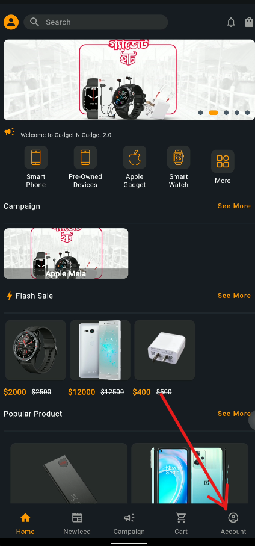
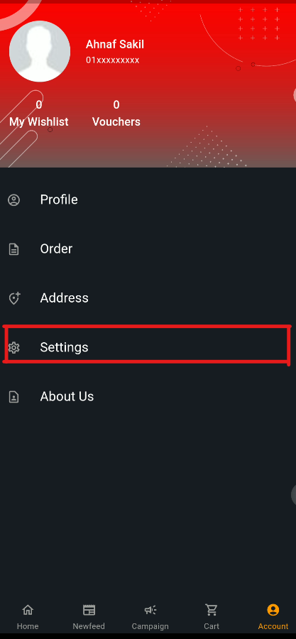
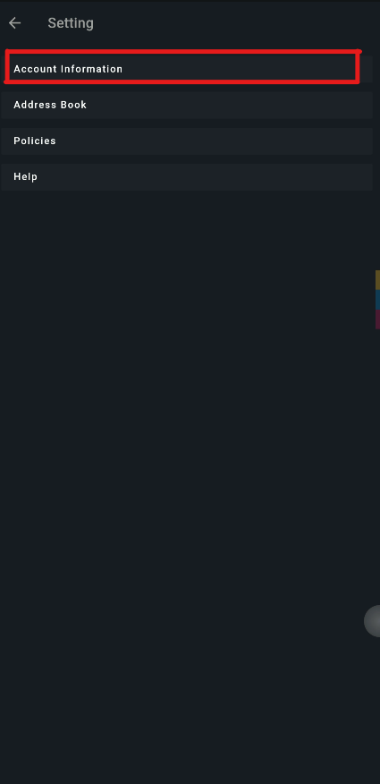
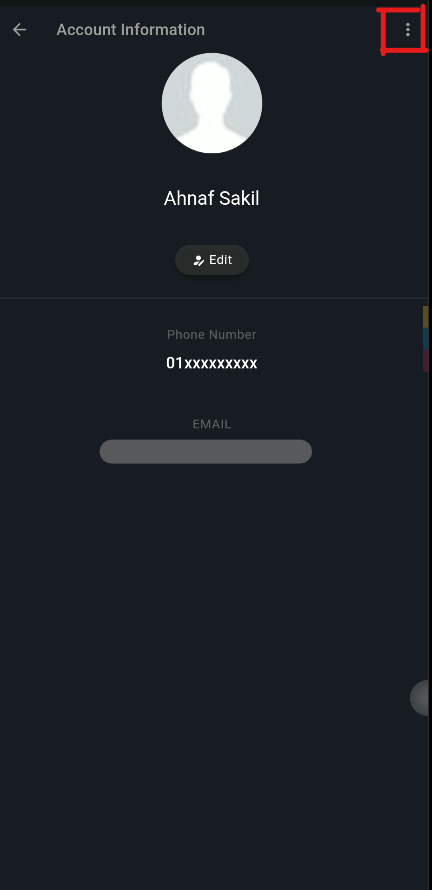
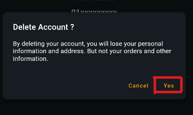

# Delete Your User Account

## What happens when I delete my account?

* your profile will be deleted from the database.

* Your personal information will be deleted.

* Your address information will be deleted.

## How do I delete my account?

* Go to the **Account Option** page from bottom Navigation Bar.

    

* Go to Settings

    

* click on the **Account Information** button.

    

* Click on the **three dot menu** button.

    

* Click on the **Delete Account**.

* Confirm that you want to delete your account and press the **Delete Account** button.

    

### Note : 

 * Other informations such as cart items, wishlist and your order data will not be deleted. 